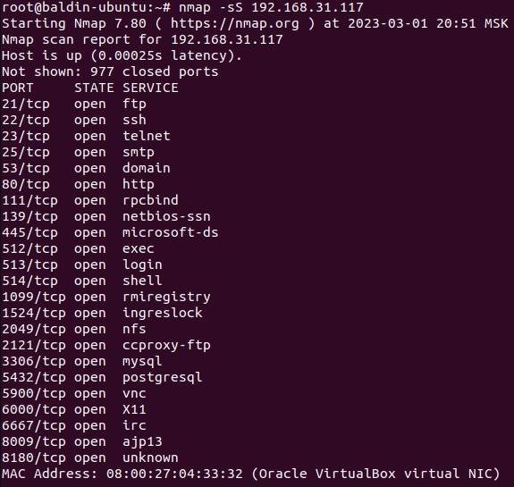
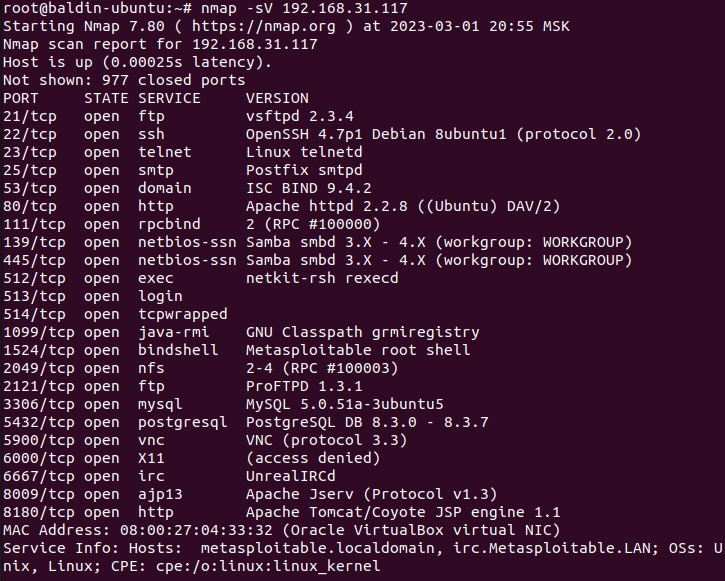
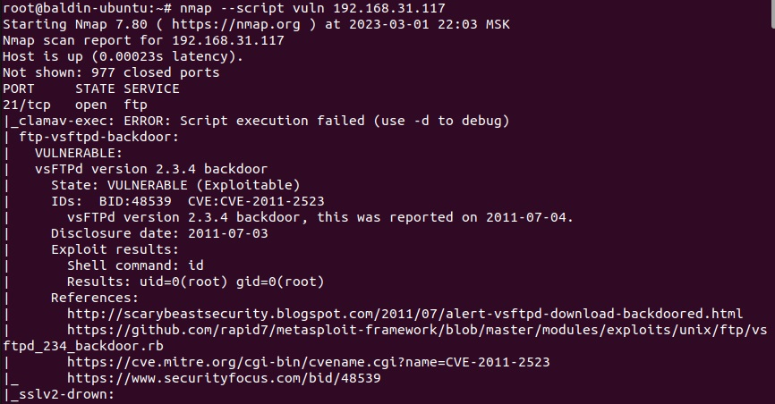

# Домашнее задание к занятию 13.1. «Уязвимости и атаки на информационные системы» - Балдин Алексей

### Задание 1

Скачайте и установите виртуальную машину Metasploitable: https://sourceforge.net/projects/metasploitable/.

Это типовая ОС для экспериментов в области информационной безопасности, с которой следует начать при анализе уязвимостей.

Просканируйте эту виртуальную машину, используя **nmap**.

Попробуйте найти уязвимости, которым подвержена эта виртуальная машина.

Сами уязвимости можно поискать на сайте https://www.exploit-db.com/.

Для этого нужно в поиске ввести название сетевой службы, обнаруженной на атакуемой машине, и выбрать подходящие по версии уязвимости.

Ответьте на следующие вопросы:

- Какие сетевые службы в ней разрешены?
- Какие уязвимости были вами обнаружены? (список со ссылками: достаточно трёх уязвимостей)

### Решение:

*Исходим из того, что целевой хост в сегменте сети обнаружен (в моем случае 192.168.31.117). В таком случае, чтобы определить, какие порты на нем открыты, я использую команду `nmap -sS 192.168.31.117` и получаю:*  

*Чтобы получить более подробную информацию по сервисам (и версиям), запуцщенным на целевом хосте, нужно: `nmap -sV 192.168.31.117`. В результате вывод будет следующим:*

*Используя эту информацию можно, с поименением скриптов, пробовать выявить уязвимости по конкретной службе/порту, и попытаться воспользоваться ими. Но в данном задании мне необходимо выявить несколько уязвимостей. Для этого ввожу: `nmap --script vuln 192.168.31.117` и получаю большой вывод, который содержит информацию по выявленным уязвимостям в следующем виде:*

Информацию по выявленным уязвимостям можно найти по идентификаторам BID, CVE
Прилагаю три ссылки на выявленные уязвимости:

[ORACLE VM SERVER 3.1/3.2](https://vuldb.com/ru/?id.74941)

[VSFTPD 2.3.4](https://vuldb.com/ru/?id.146452)

[SSLV3 POODLE](https://vuldb.com/ru/?id.92602)

### Задание 2

Проведите сканирование Metasploitable в режимах SYN, FIN, Xmas, UDP.

Запишите сеансы сканирования в Wireshark.

Ответьте на следующие вопросы:

- Чем отличаются эти режимы сканирования с точки зрения сетевого трафика?
- Как отвечает сервер?

*Приведите ответ в свободной форме.*
